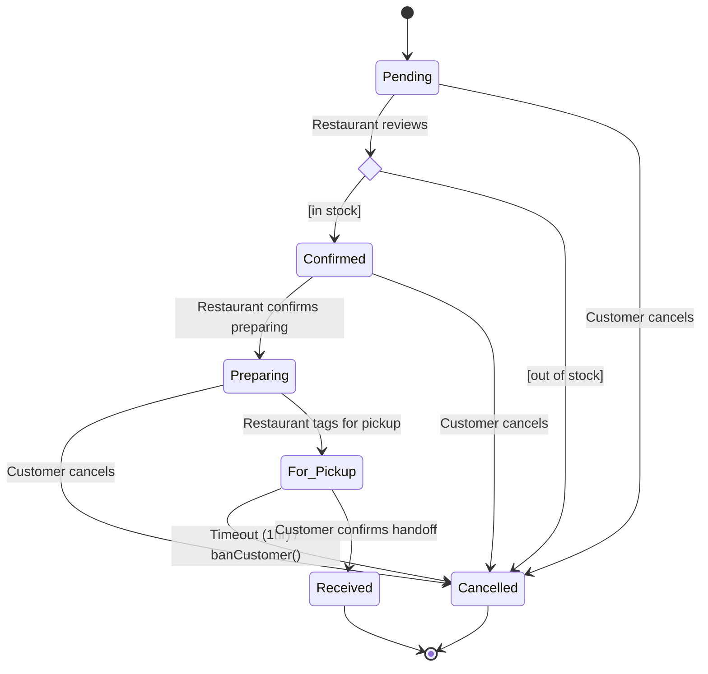

# OrderTaker — Food Ordering REST API

A Spring Boot backend for a food ordering platform connecting customers and restaurants, built as a portfolio project to demonstrate backend API design, relational data modeling, and secure REST API development.

## Table of Contents
- [Overview](#overview)
- [Tech Stack](#tech-stack)
- [Data Model](#data-model)
- [Order Status Lifecycle](#order-status-lifecycle)
- [API Structure](#api-structure)
- [Implementation Roadmap](#implementation-roadmap)
- [Getting Started](#getting-started)
- [Future Enhancements](#future-enhancements)
- [Author](#author)

## Overview

OrderTaker models the core flow of a food ordering platform: customers browse restaurants and menus, build a cart, place an order, and track it through to pickup, while restaurant owners manage their menu and fulfill incoming orders. Particular attention went into data integrity — soft-deletes that preserve order history, price snapshotting at checkout — and into modeling the order lifecycle as an explicit state machine rather than an open-ended status field.

## Tech Stack

- **Language:** Java
- **Framework:** Spring Boot (Spring Web, Spring Data JPA, Spring Security)
- **Auth:** JWT-based authentication, email + password login
- **Database:** Relational — TBD between MySQL and PostgreSQL. The schema's type syntax (e.g. `BIGINT(20)` display widths) reflects MySQL conventions, but the deploy plan targets Render + Supabase/Neon, which are Postgres-based — worth settling before writing entity definitions, since PostgreSQL doesn't support MySQL's integer display-width syntax
- **Build tool:** *TBD — Maven or Gradle*

## Data Model

Eight core entities: a `User` is either a `Customer` or a `Restaurant` owner via a shared, role-differentiated identity table; a `Restaurant` owns its `MenuItems`; a `Customer` has at most one active `Cart`, made up of `CartItems`; and a completed order becomes an `Order` with its own `OrderItems`, permanently decoupled from the live menu via a price snapshot.

| Entity | Role |
|---|---|
| `Users` | Shared identity table for both account types (email, password, role) |
| `Customers` | Customer-specific profile data, linked 1:1 to a `User` |
| `Restaurants` | Restaurant profile and business info, linked 1:1 to an owning `User` |
| `MenuItems` | A restaurant's menu, with independent availability and deletion flags |
| `Carts` / `CartItems` | A customer's in-progress order — live pricing, not yet committed |
| `Orders` / `OrderItems` | A committed order — snapshotted pricing (`priceAtOrderTime`), drives the status lifecycle below |

Full entity-relationship diagram: [`erd.puml`](./erd.puml)

## Order Status Lifecycle

Order status is modeled as an explicit state machine rather than a free-form field, so invalid transitions — skipping steps, cancelling an already-picked-up order — are rejected rather than silently allowed.

## API Structure

Four controllers, fully documented (methods, paths, auth, request/response shapes, status codes) — see the endpoint documentation for the complete spec.

| Controller | Mapping | Handles |
|---|---|---|
| `AuthCustomerController` | `/auth` | Customer signup, login, logout |
| `AuthRestaurantController` | `/auth/restaurants` | Restaurant owner signup, login, logout |
| `CustomerController` | `/api/v1/customers` | Profile, cart, and order placement/tracking/cancellation |
| `RestaurantController` | `/api/v1/restaurants` | Public restaurant/menu browsing, restaurant profile, menu management, incoming order fulfillment |

Notable decisions baked into the contract:
- Cart is resolved from the JWT, not a path parameter — a customer has exactly one active cart, so there's nothing to look up by ID.
- Menu items carry two independent flags: `isAvailable` (temporary, restaurant-toggleable) and `isDeleted` (permanent removal from active views, filtered out everywhere except order history, so past orders still display correctly).
- Every state-changing status update returns `409 Conflict` on an invalid transition rather than silently accepting it.

## Implementation Roadmap

**Phase 0 — Planning & Design** ✅
- [x] Scope, entities, roles, and core user flows locked
- [x] Entity-relationship diagram
- [x] Order status state machine
- [x] Full REST API contract across all four controllers

**Phase 1 — Core CRUD**
- [ ] `User`, `Restaurant`, `MenuItem` entities + repositories
- [ ] Service layer with real business rules (not pass-through) — e.g. prices can't be negative
- [ ] Controllers returning DTOs, never raw entities, with correct HTTP status codes
- [ ] Bean validation on inputs

**Milestone:** Postman collection exercising full CRUD on all three resources.

**Phase 2 — Cart & Order Placement**
- [ ] `Cart`/`CartItem` entities, JWT-resolved, one active cart per customer
- [ ] Restaurant-lock validation when adding items (reject cross-restaurant additions)
- [ ] Checkout: cart-to-order conversion with server-side total calculation (never trust a client-sent total), availability re-check, price snapshot (`priceAtOrderTime`), single transaction, cart clearing

**Milestone:** placing an order via the API produces a correct, persisted order with an accurate total.

**Phase 3 — Order Status State Machine**
- [ ] Status enum + service method enforcing valid transitions only — final flow is pickup-based: `Pending → Confirmed/Cancelled → Preparing → For_Pickup/Cancelled → Received`, not the delivery-based sketch from initial planning
- [ ] Role-based transition rules (only the restaurant confirms/preps/tags for pickup; only the customer confirms handoff or cancels within allowed states)
- [ ] 1-hour pickup timeout with automatic cancellation and customer ban

**Milestone:** an illegal transition returns a clean 409, not a 500.

**Phase 4 — JWT Authentication & Authorization** *(usually the most-scrutinized part of a junior Java portfolio project)*
- [ ] Spring Security setup, BCrypt password hashing
- [ ] JWT issued on login (email + password, not username)
- [ ] Role-based endpoint access (`ROLE_CUSTOMER` / `ROLE_RESTAURANT` — confirm whether a separate admin role is still needed for the restaurant-deletion approval flow)
- [ ] Token expiry/refresh strategy — not yet decided

**Milestone:** every protected endpoint correctly rejects unauthenticated/unauthorized calls.

**Phase 5 — Testing & Hardening** *(turns "runs on my machine" into something you can defend in an interview)*
- [ ] Unit tests for service-layer rules (state transitions, total calculation, validation)
- [ ] Integration tests (Testcontainers or in-memory DB) for main happy paths
- [ ] Global exception handler (`@ControllerAdvice`) for consistent JSON errors, not stack traces
- [ ] `docker-compose.yml` that boots the whole thing with one command

**Milestone:** green test suite + one-command local boot.

**Phase 6 — Docs, Polish & Deploy**
- [x] README
- [ ] OpenAPI/Swagger docs generated from the code
- [ ] Deploy to Render's free web service tier (no card required; pair with an always-free DB like Supabase or Neon, since Render's free Postgres expires after 90 days)
- [ ] Live URL confirmed working end-to-end

**Milestone:** live URL + polished README.

## Getting Started

*To be added once Phase 1 is complete.*

## Future Enhancements

- **Android client** — explicitly out of scope for this project; planned as a separate portfolio piece after OrderTaker ships.

## Author

**Royce Vincent Chua**
rvmchua@gmail.com